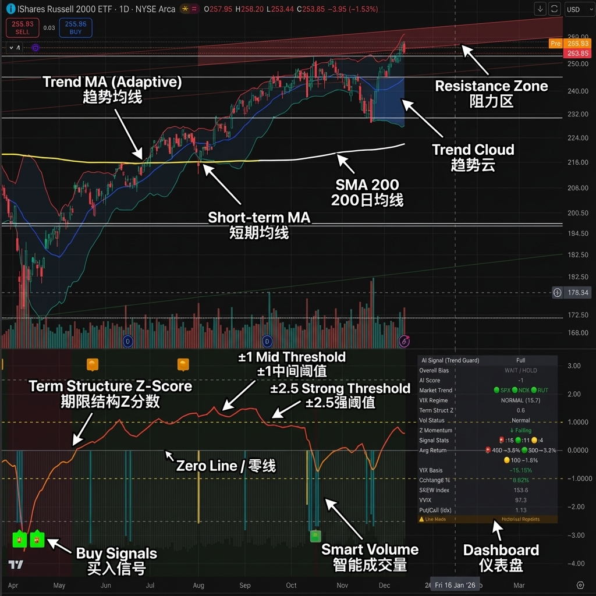
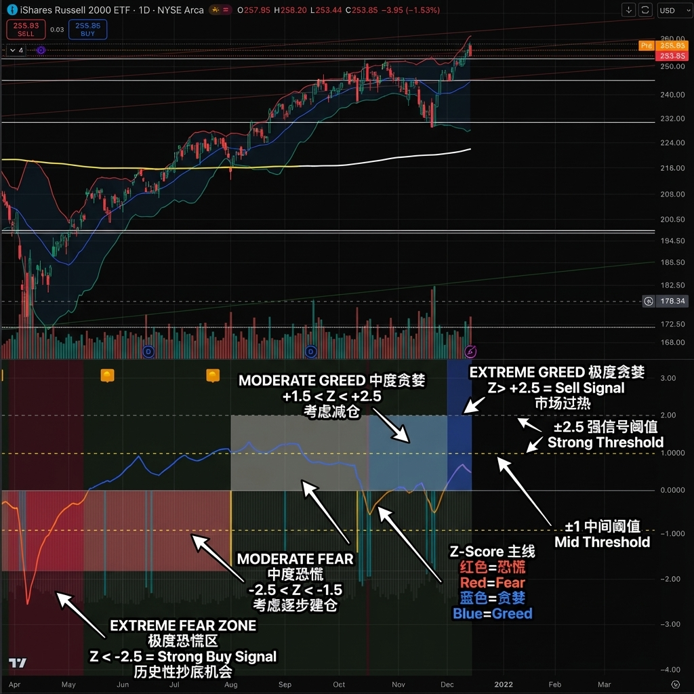

# VIX Term Structure Pro v7.6

[](https://www.tradingview.com/scripts/)
[](https://www.tradingview.com/pine-script-reference/v6/)
[](https://opensource.org/licenses/MIT)

**Professional VIX-based Market Sentiment & Timing Indicator**

**专业的 VIX 市场情绪与择时指标**

---

## 🌟 Overview | 概述

**English:**
VIX Term Structure Pro is an advanced multi-factor market timing indicator that combines VIX futures term structure analysis, adaptive volatility regime detection, and comprehensive market breadth monitoring to generate high-precision buy/sell signals.

**中文：**
VIX Term Structure Pro 是一款高级多因子市场择时指标，结合 VIX 期货期限结构分析、自适应波动率区间检测和全面的市场广度监控，生成高精度的买卖信号。

---

## 🚀 Key Features | 核心功能

### 📊 Multi-Factor Scoring System | 多因子评分系统

| Factor | English | 中文 |
|--------|---------|------|
| **Term Structure Z-Score** | Auto-adjusts lookback based on volatility regime | 自适应期限结构 Z 分数，根据波动率区间自动调整回望期 |
| **VIX/VX1 Basis** | Percentile-based panic detection | VIX 现货溢价，基于百分位数的恐慌检测 |
| **Contango Analysis** | Futures curve shape insights | 期货升水分析，期货曲线形态洞察 |
| **Multi-Mode SKEW** | Relative Z-Score, Percentile, or Absolute modes | 多模式 SKEW 整合，支持相对/百分位/绝对阈值 |
| **Put/Call Ratio** | Adaptive sentiment extremes detection | 看跌/看涨比率，自适应情绪极端检测 |
| **Smart Volume** | Normalized visualization with spike detection | 智能成交量，归一化可视化与激增检测 |
| **VVIX** | Volatility of volatility (optional) | 波动率的波动率（可选） |

### 🔬 VIX Characteristics Analysis | VIX 特性分析 (v7.5+)

| Feature | English | 中文 |
|---------|---------|------|
| **Mean Reversion** | Tracks σ distance from long-term mean (~19-20) | 追踪 VIX 与长期均值的距离 |
| **Backwardation Duration** | Days in backwardation (5-7 days = optimal entry) | Backwardation 持续天数 |
| **Asymmetric Momentum** | Detects panic spikes vs slow decay | 非对称动量（涨快跌慢） |
| **VIX-SPX Divergence** | Bullish/Bearish divergence signals | VIX-SPX 背离信号 |
| **Volatility Clustering** | State: CRISIS/ELEVATED/NORMAL/DECLINING/SUPPRESSED | 波动聚集状态 |

### 🎯 Three-Tier Signal System | 三级信号系统

| Signal | Score | English | 中文 | Return Period |
|--------|-------|---------|------|---------------|
| 🚨 **CRASH BUY** | ≥ 6 | Extreme panic, rare opportunity | 极端恐慌，罕见机会 | 40 days / 约2个月 |
| 🟢 **STRONG BUY** | ≥ 5 | Multi-factor confluence | 多因子共振 | 20 days / 约1个月 |
| 🟡 **BUY DIP** | ≥ 4 | Accumulate on weakness | 逢低吸纳 | 10 days / 约2周 |
| 🟠 **SELL/HEDGE** | ≤ -2 | Consider reducing risk | 考虑减仓对冲 | - |
| 🔴 **STRONG SELL** | ≤ -5 | Strong bearish signals | 强烈看跌信号 | - |
| 🔥 **EUPHORIA SELL** | ≤ -6 | Extreme greed, sell signal | 极度贪婪，卖出信号 | - |

### 🎨 Signal Confirmation | 信号确认机制

#### Momentum Confirmation | 动量确认
| Feature | English | 中文 |
|---------|---------|------|
| Z-Score Momentum | Tracks rate of change with neutral zone filtering | Z 分数动量追踪变化率，带中性区域过滤 |
| Configurable Lookback | Adjustable period (1-10 bars) | 可配置回望期（1-10 根 K 线） |
| Neutral Zone | Filters noise to avoid false signals | 中性区域过滤噪音，避免虚假信号 |

#### Multi-Timeframe (MTF) Confirmation | 多时间框架确认
| Feature | English | 中文 |
|---------|---------|------|
| Weekly Z-Score Alignment | Requires weekly confirmation for strongest signals | 周线 Z 分数对齐，最强信号需要周线确认 |
| Optional Toggle | Enable/disable based on trading style | 可选开关，基于交易风格启用/禁用 |

### 📈 Dashboard Indicators | 仪表盘指标

#### Mobile Mode | 移动模式 (2 rows) - v7.6

| Row | Column 1 | Column 2 | English | 中文 |
|-----|----------|----------|---------|------|
| 1 | Signal (🟢 STRONG BUY) | Score (+6) | Trading signal | 交易信号 |
| 2 | VIX:28 HIGH VOL | Z:-2.3 | VIX value + regime | VIX 值 + 区间 |

> 📱 **Minimal display for mobile devices** / 适合手机端的极简显示

#### Compact Mode | 精简模式 (8 rows)

| Row | Indicator | English | 中文 |
|-----|-----------|---------|------|
| 1 | Overall Bias | Current signal recommendation | 当前信号建议 |
| 2 | AI Score | Composite scoring (-10 to +10) | 综合评分 |
| 3 | Market Trend | SPX/NDX/RUT vs Trend MA | 三指数趋势状态 |
| 4 | VIX Regime | LOW VOL / NORMAL / HIGH VOL | 波动率区间 |
| 5 | Term Struct Z | Normalized Z-Score value | 标准化 Z 分数值 |
| 6 | Vol Status | Smart volume spike detection | 智能成交量状态 |
| 7 | Z Momentum | Directional momentum indicator | Z 动量方向 |
| 8 | Signal Stats | Historical signal count | 历史信号统计 |
|   | **Status Info** | **Signal Filtering Feedback** | **信号过滤反馈** |

#### 💡 Status Explanations | 状态说明

| Status | English | 中文 | Meaning | 含义 |
|--------|---------|------|---------|------|
| **WAIT** | Wait (Buy Side) | 等待 (买入侧) | Score is high, but filtered (High Vol or Momentum). Wait for entry. | 评分达标但被过滤（如高波动或动量未确认）。不要急于进场。 |
| **HOLD** | Hold (Sell Side) | 持有 (卖出侧) | Score is low, but filtered (Low Vol or Momentum). Hold position. | 评分达标但被过滤（如低波动或动量未确认）。不要急于卖出，继续持有。 |

#### Full Mode | 完整模式 (12-17 rows)

Includes all Compact mode data plus: / 包含精简模式全部数据，另加：

| Row | Indicator | English | 中文 |
|-----|-----------|---------|------|
| 9-10 | Avg Return | Split by signal tier | 分级平均收益 |
| 11 | VIX Basis | VIX spot premium % | VIX 现货溢价 |
| 12 | Contango % | VX1/VX2 term structure slope | 期限结构斜率 |
| 13 | SKEW Index | Current SKEW with color coding | SKEW 指数 |
| 14 | VVIX | Volatility of VIX (if enabled) | VIX 的波动率 |
| 15 | Put/Call | Index put-call ratio | 指数看跌/看涨比 |
| 16 | Max Profit | Max profit within period (optional) | 最大收益（可选） |
| 17 | ⚠️ Warning | Live Mode repaint warning | 重绘警告（实时模式） |

---

## ⚙️ Configuration | 配置选项

### 📡 Data Sources | 数据源

| Setting | Default | English | 中文 |
|---------|---------|---------|------|
| VIX Symbol | `CBOE:VIX` | VIX data source (Alt: `TVC:VIX`) | VIX 数据源 |
| VIX Timeframe | Daily | Daily (stable) or Chart (real-time) | 日线（稳定）或图表（实时） |
| Put/Call Ratio | `INDEX:CPCI` | Index P/C (Alt: `INDEX:PCC` Equity) | 指数期权看跌/看涨比 |
| Manual Trend Source | `SP:SPX` | Custom symbol when Auto-Detect OFF | 手动趋势源（自动检测关闭时使用） |

### ⚠️ Strategy Mode | 策略模式

| Mode | Sensitivity | Z Thresholds | Min Score | English | 中文 |
|------|-------------|--------------|-----------|---------|------|
| **High (Scalping)** | Most sensitive | ±1.0 / ±2.0 | 2 | Short-term trades | 短线交易 |
| **Normal (Swing)** | Balanced | ±1.2 / ±2.2 | 3 | Swing trading | 波段交易 |
| **Low (Trend/Safe)** | Conservative | ±1.5 / ±2.5 | 4 | Position trading | 趋势跟踪 |

### 🛡️ Market Trend Filter | 市场趋势过滤

#### Trend MA Mode | 趋势均线模式 (v7.1)

| Mode | English | 中文 | Use Case | 适用场景 |
|------|---------|------|----------|----------|
| **Fixed** | Fixed length SMA/EMA | 固定长度 SMA/EMA | Classic TA preference | 偏好经典技术分析 |
| **Adaptive** | VIX-based dynamic length | 根据 VIX 水平动态切换长度 | Volatility-driven trading | 波动率驱动型交易 |
| **KAMA** | Kaufman Adaptive MA | Kaufman 自适应均线 | Price action focus | 注重价格行为 |

| Setting | English | 中文 |
|---------|---------|------|
| When ON | Disables 🟡 BUY DIP when below trend MA | 低于趋势均线时禁用 BUY DIP |
| CRASH/STRONG BUY | Always allowed (extreme panic overrides) | 始终允许（极端恐慌优先） |
| Auto-Detect Index | QQQ→NDX, IWM→RUT, Others→SPX | 自动检测主趋势指数 |

### 🎯 Signal Confirmation | 信号确认

| Setting | Default | English | 中文 |
|---------|---------|---------|------|
| 🔒 Confirmed Signals Only | ON | Signals only trigger on bar close | 信号仅在 K 线收盘时触发 |
| Momentum Confirmation | ON | Require Z-Score momentum alignment | 需要 Z 动量确认 |
| Momentum Lookback | 3 bars | Momentum calculation period | 动量计算周期 |
| Neutral Zone | 0.05 | Filter minor fluctuations | 过滤微小波动 |
| Weekly MTF Confirmation | OFF | Require weekly Z alignment | 需要周线 Z 对齐 |
| Signal Display Cooldown | 5 bars | Prevent frequent same-type signals | 避免同类信号频繁触发 (v7.3) |

### 🎨 Chart Style | 图表样式

| Setting | English | 中文 |
|---------|---------|------|
| Show Term Struct Z-Score | Main Z-Score line visibility | 显示期限结构 Z 分数线 |
| Show Scaled SKEW Line | SKEW visualization (scaled) | 显示缩放 SKEW 线 |
| Show Smart Volume | Volume columns with spike highlighting | 显示智能成交量柱 |
| ±1 Line Color/Style | Customizable mid-threshold lines | 可自定义 ±1 参考线颜色/样式 |

### 📋 Dashboard | 仪表盘

| Setting | Options | English | 中文 |
|---------|---------|---------|------|
| Dashboard Mode | Mobile / Compact / Full | Minimal 2-row / Essential / All indicators | 极简两行 / 精简 / 完整指标 |
| Dashboard Position | 6 positions | Top/Bottom + Left/Right/Center | 6 种位置选项 (v7.1) |
| Text Size | Small / Normal / Large | Dashboard text size | 文字大小 |
| Transparency | 0-100% | Background transparency | 背景透明度 |

### 📊 Statistics & Alerts | 统计与警报

| Setting | Default | English | 中文 |
|---------|---------|---------|------|
| Signal Statistics | ON | Show historical signal count | 显示历史信号统计 |
| Show Max Profit Stats | OFF | Show max profit within period | 显示周期内最高收益 (v7.1) |
| Stats Lookback | 3 years | Only count signals within range | 统计回溯年数 |
| 🚨 CRASH Return Period | 40 bars | ~2 months for extreme panic | CRASH 收益周期（约2个月） |
| 🟢 STRONG Return Period | 20 bars | ~1 month for strong signals | STRONG 收益周期（约1个月） |
| 🟡 DIP Return Period | 10 bars | ~2 weeks for dip buying | DIP 收益周期（约2周） |
| Alert Cooldown | 5 bars | Prevent spam alerts | 警报冷却间隔 |

### ⚙️ Advanced Settings | 高级设置

#### VIX Regime Thresholds | VIX 区间阈值

| Setting | Default | English | 中文 |
|---------|---------|---------|------|
| Low Vol Threshold | 15.0 | Below = LOW VOL regime | 低于此值为低波动区间 |
| High Vol Threshold | 25.0 | Above = HIGH VOL regime | 高于此值为高波动区间 |

#### Adaptive Thresholds | 自适应阈值

| Setting | Default | English | 中文 |
|---------|---------|---------|------|
| Use Adaptive Thresholds | ON | Percentile-based dynamic thresholds | 使用百分位动态阈值 |
| Adaptive Lookback | 252 bars | 1 year lookback period | 自适应回溯周期（1年） |

#### Z-Score Calculation | Z 分数计算

| Setting | Default | English | 中文 |
|---------|---------|---------|------|
| Use Adaptive Lookback | ON | Shorter lookback in high-vol | 高波动期用短周期 |
| Lookback (Low Vol) | 252 bars | 1 year | 低波动回溯（1年） |
| Lookback (High Vol) | 126 bars | 6 months | 高波动回溯（半年） |
| Vol Regime Threshold | 20.0 | VIX threshold for regime switch | 波动区间切换阈值 |

#### SKEW Settings | SKEW 设置

| Mode | English | 中文 |
|------|---------|------|
| Relative (Z-Score) | Normalized deviation from mean | 相对标准差（默认） |
| Percentile (Adaptive) | Uses 90th/10th percentiles | 使用百分位数 |
| Absolute (>140) | Fixed threshold at 140 | 固定阈值 140 |

#### Volume Settings | 成交量设置

| Setting | Default | English | 中文 |
|---------|---------|---------|------|
| Volume Avg Length | 20 bars | Moving average length | 成交量均线长度 |

### 📈 VVIX Integration | VVIX 整合 (Optional)

#### VVIX Threshold Mode | VVIX 阈值模式 (v7.1)

| Mode | English | 中文 | Use Case | 适用场景 |
|------|---------|------|----------|----------|
| **Fixed** | Fixed thresholds 130/80 | 固定阈值 130/80 | Simple and intuitive | 简单直观 |
| **Percentile** | 90th/10th percentiles | 使用 90/10 分位数 | Resilient to outliers | 对极端值不敏感 |
| **Z-Score** | ±2 standard deviations | 使用 ±2 标准差 | Consistent with project logic | 与项目逻辑一致（默认） |

| Setting | Default | English | 中文 |
|---------|---------|---------|------|
| Enable VVIX | OFF | Toggle VVIX integration | 启用 VVIX 整合 |
| Z-Score Threshold | 2.0 | Z threshold for panic/calm | Z 阈值 |
| Fixed Panic Threshold | 130.0 | For Fixed mode only | 固定恐慌阈值 |
| Fixed Calm Threshold | 80.0 | For Fixed mode only | 固定平静阈值 |

### 🔬 Backtest Mode | 回测模式

| Mode | English | 中文 |
|------|---------|------|
| OFF (Real-time) | Uses `lookahead_on` for current day data | 实时模式，显示当日数据 |
| ON (Historical) | Uses `lookahead_off` to avoid future bias | 回测模式，避免未来函数 |

> ⚠️ **v7.1**: Live Mode 下仪表盘底部会显示 "⚠️ Live Mode - Historical Repaints" 警告。
>
> In Live Mode, a warning appears at the bottom of the dashboard indicating historical signals may repaint.

---

## 📈 Chart Guide | 图表指南



### Top Panel Elements | 上方面板元素

| Element | Color | English | 中文 |
|---------|-------|---------|------|
| Price Candles | Red/Green | Daily price action | 日线价格走势 |
| Trend MA | Blue | Adaptive trend moving average | 自适应趋势均线 |
| SMA 200 | White | 200-day simple moving average | 200日简单均线 |
| Short-term MA | Yellow | Short-term trend reference | 短期趋势参考 |
| Trend Cloud | Blue shaded | Area between MAs showing trend | 均线间区域显示趋势 |
| Resistance Zone | Red bands | Key resistance levels | 关键阻力位 |

### Bottom Panel Elements | 下方面板元素 (VIX Indicator)

| Element | Color | English | 中文 |
|---------|-------|---------|------|
| Term Structure Z-Score | Orange/Red line | Main indicator line (fear/greed) | 主指标线（恐慌/贪婪） |
| Zero Line | Gray solid | Neutral reference | 中性参考线 |
| ±1 Threshold | Yellow dashed | Mid-level threshold | 中间阈值 |
| ±2.5 Threshold | Gray dashed | Strong signal threshold | 强信号阈值 |
| Smart Volume | Cyan/Gray bars | VX1 futures volume (normalized) | VX1 期货成交量（归一化） |
| 🟢🟡 Buy Signals | Green/Yellow labels | Buy signal markers | 买入信号标记 |
| 🔴🟠 Sell Signals | Red/Orange labels | Sell signal markers | 卖出信号标记 |
| Dashboard | Right panel | Real-time indicator values | 实时指标数值 |

### Reading the Z-Score Line | 解读 Z 分数线



#### Z-Score Zones & Trading Actions | Z 分数区域与交易操作

| Zone | Z-Score | Color | Signal | English Action | 中文操作 |
|------|---------|-------|--------|----------------|----------|
| 🔴 **Extreme Fear** | < -2.5 | Deep Red | 🚨 CRASH BUY | Aggressive entry, rare opportunity | 激进进场，罕见机会 |
| 🟠 **Moderate Fear** | -2.5 to -1.5 | Red | 🟢 STRONG BUY | Build positions gradually | 逐步建仓 |
| 🟡 **Mild Fear** | -1.5 to -1.0 | Orange-Red | 🟡 BUY DIP | Consider adding to positions | 考虑加仓 |
| ⚪ **Neutral** | -1.0 to +1.0 | Orange | WAIT/HOLD | No clear signal, wait | 无明确信号，观望 |
| 🟡 **Mild Greed** | +1.0 to +1.5 | Light Orange | Caution | Monitor for reversal | 关注反转信号 |
| 🟠 **Moderate Greed** | +1.5 to +2.5 | Light Blue | 🟠 SELL/HEDGE | Consider reducing exposure | 考虑减仓对冲 |
| 🔴 **Extreme Greed** | > +2.5 | Blue | 🔥 EUPHORIA SELL | Strong sell signal, market overheated | 强卖出信号，市场过热 |

#### Key Observations | 关键观察

| Pattern | English | 中文 |
|---------|---------|------|
| Z crosses below -2.5 | Panic selling, institutional fear | 恐慌抛售，机构恐惧 |
| Z rises from extreme lows | Recovery beginning, early buy | 复苏开始，早期买点 |
| Z stays near zero | Balanced market, wait for direction | 市场平衡，等待方向 |
| Z crosses above +2.5 | Complacency peak, prepare to hedge | 自满顶峰，准备对冲 |
| Z falling from highs | Greed fading, watch for weakness | 贪婪消退，关注走弱 |

---

## 📖 Usage Guide | 使用指南

### Best Practices | 最佳实践

| # | English | 中文 |
|---|---------|------|
| 1 | Apply to major index daily charts (SPX, SPY, QQQ, IWM) | 在主要指数日线图上使用 |
| 2 | Wait for daily close before acting on signals | 等待日线收盘后再执行信号 |
| 3 | Use Strategy Mode matching your timeframe | 使用匹配时间框架的策略模式 |
| 4 | Enable Trend Filter for capital preservation in bear markets | 熊市中开启趋势过滤保护资本 |
| 5 | Review Signal Stats in Full mode to calibrate expectations | 查看完整模式信号统计以校准预期 |

### Signal Interpretation | 信号解读

#### 🚨 CRASH BUY (Score ≥ 6)

| English | 中文 |
|---------|------|
| Extreme multi-factor panic (VIX spike + basis panic + deep Z-Score) | 极端多因子恐慌（VIX 激增 + 基差恐慌 + 深度 Z 分数） |
| Historical: Occurs 1-3 times per year during crashes | 历史：每年市场崩盘时出现 1-3 次 |
| Action: Aggressive entry, high conviction | 操作：激进进场，高确信度 |

#### 🟢 STRONG BUY (Score ≥ 5)

| English | 中文 |
|---------|------|
| Multiple fear indicators align | 多个恐慌指标对齐 |
| Historical: Occurs 5-10 times per year | 历史：每年出现 5-10 次 |
| Action: Build positions, medium conviction | 操作：建仓，中等确信度 |

#### 🟡 BUY DIP (Score ≥ 4)

| English | 中文 |
|---------|------|
| Moderate fear detected | 检测到中等恐慌 |
| v7.3: VIX cannot be HIGH VOL + requires Z Momentum falling | v7.3：VIX 不能处于高波动 + 需要 Z 动量下降 |
| Filtered out in bear markets if Trend Filter ON | 趋势过滤开启时熊市中被过滤 |
| Action: Add to existing positions, lower conviction | 操作：加仓现有头寸，较低确信度 |

#### � SELL/HEDGE (Score ≤ -2)

| English | 中文 |
|---------|------|
| Complacency or greed detected | 检测到自满或贪婪 |
| v7.3: VIX cannot be LOW VOL + requires Z Momentum rising | v7.3：VIX 不能处于低波动 + 需要 Z 动量上升 |
| Consider reducing exposure or hedging | 考虑减仓或对冲 |
| Less reliable than buy signals (VIX mean-reverts asymmetrically) | 可靠性低于买入信号（VIX 不对称均值回归） |

### Chart Elements | 图表元素

| Element | English | 中文 |
|---------|---------|------|
| Z-Score Line | Red (fear) to Blue (complacency) gradient | 红色（恐慌）到蓝色（自满）渐变 |
| ±1 / ±2.5 Lines | Configurable threshold references | 可配置阈值参考线 |
| Smart Volume (Gray) | Normal volume | 正常成交量 |
| Smart Volume (Aqua) | High volume (>1.5x average) | 高成交量（>1.5 倍均值） |
| Smart Volume (Yellow) | Panic spike (>2.5x average) | 恐慌激增（>2.5 倍均值） |
| Signal Labels | Buy (bottom) / Sell (top) emoji markers | 买入（下方）/ 卖出（上方）表情标记 |

---

## 📊 Historical Statistics | 历史统计

### Statistics Calculation | 统计计算

| Item | English | 中文 |
|------|---------|------|
| Lookback Range | User-defined (1-20 years, default 3) | 用户定义（1-20 年，默认 3） |
| Signal Count | Frequency of each signal tier | 各级信号频率 |
| Average Returns | SPX forward returns by tier | 按级别的 SPX 前向收益 |
| Max Profit | Highest price within period (optional) | 周期内最高价格（可选） |

### Return Display | 收益显示 (Full Mode Only)

```
Avg Return Row 1: 🚨40D:+X.X% 🟢20D:+X.X%
Avg Return Row 2: 🟡10D:+X.X%
Max Profit Row:   🚨+X.X% 🟢+X.X% 🟡+X.X%
```

---

## 🔔 Alerts | 警报

### Smart Alert System (v7.3) | 智能警报系统

**English:**
The unified Smart Alert system aggregates all buy/sell signals into comprehensive messages with rising edge detection to prevent duplicate notifications.

**中文：**
统一智能警报系统将所有买卖信号聚合为综合消息，采用上升沿检测防止重复通知。

### Alert Message Format | 警报消息格式

| Signal Type | Format | Example | 示例 |
|-------------|--------|---------|------|
| � Buy Signals | `{Ticker}: 🟢 BUY → [Signal Tags] \| Context` | `SPY: 🟢 BUY → 🚨CRASH 🟢STRONG \| Score:6 Z:-2.5 VIX:35(HIGH VOL) 🔴SPX 🟢NDX 🟢RUT` | 包含评分、Z分数、VIX状态、三指数趋势 |
| � Sell Signals | `{Ticker}: 🔴 SELL → [Signal Tags] \| Context` | `QQQ: � SELL → 🔥EUPHORIA 🟠HEDGE \| Score:-6 Z:2.8 SKEW:148 🟢SPX 🟢NDX 🟢RUT` | 包含评分、Z分数、SKEW、三指数趋势 |

### VIX Regime Adaptive Cooldown | VIX 区间自适应冷却

| VIX Regime | Cooldown Multiplier | English | 中文 |
|------------|---------------------|---------|------|
| HIGH VOL (>25) | 0.5x (halved) | Faster alerts during volatility | 高波动期警报更频繁 |
| NORMAL (15-25) | 1.0x (base) | Standard cooldown period | 标准冷却间隔 |
| LOW VOL (<15) | 2.0x (doubled) | Reduced noise in calm markets | 低波动期减少干扰 |

### Alert Configuration | 警报配置

| Setting | Default | English | 中文 |
|---------|---------|---------|------|
| 🔔 Smart Alert | ON | Enable unified alert system | 启用统一智能警报 |
| Alert Cooldown Base | 5 bars | Base cooldown (adjusted by VIX Regime) | 基础冷却间隔（根据VIX区间调整） |
| Alert Frequency | Real-time | Real-time or Once Per Bar | 实时模式或每K线一次 |

---

## 🧮 Scoring Algorithm | 评分算法

### Modular Scoring Functions | 模块化评分函数

```pinescript
Total Score = 
  + Z-Score Points (-4 to +4)      // Z 分数得分
  + Contango Points (-1 to +2)     // 升水得分
  + Basis Points (-1 to +2)        // 基差得分
  + SKEW Points (-3 to +1)         // SKEW 得分
  + P/C Ratio Points (-2 to +2)    // 看跌/看涨比得分
  + VVIX Points (-1 to +1)         // VVIX 得分（如启用）
  + Volume Spike Bonus (+1)        // 成交量激增奖励
  + Momentum Bonus (±1)            // 动量奖励
  + MTF Bonus (±1)                 // 多时间框架奖励
  - Trend Penalty (-2)             // 趋势惩罚（熊市过滤开启时）
```

### Point Allocation | 得分分配

| Factor | Condition | Points | English | 中文 |
|--------|-----------|--------|---------|------|
| **Z-Score** | < -2.5 | +4 | Extreme fear | 极度恐慌 |
| | < -1.5 | +2 | Moderate fear | 中度恐慌 |
| | > +1.5 | -2 | Moderate complacency | 中度自满 |
| | > +2.5 | -4 | Extreme complacency | 极度自满 |
| **Contango** | < 0% | +2 | Backwardation | 反向期货曲线 |
| | > 10% | -1 | High contango | 高升水 |
| **VIX Basis** | Panic level | +2 | Spot premium spike | 现货溢价激增 |
| | Calm level | -1 | Normal/discount | 正常/折价 |
| **SKEW** | High tail risk | -3 | Elevated crash risk | 尾部风险升高 |
| | Low tail risk | +1 | Reduced crash risk | 尾部风险降低 |
| **P/C Ratio** | > 1.20 | +2 | Extreme fear | 极度恐慌 |
| | < 0.70 | -2 | Extreme greed | 极度贪婪 |

---

## 📋 Changelog | 更新日志

### v7.6 (2025-12-26 | Current | 当前版本)

**📱 Mobile Mode | 移动模式**
- **2-Row Minimal Display**: Ultra-compact dashboard showing only essential info
  两行极简显示：仅显示核心信息
  - Row 1: Signal + Score (e.g., "🟢 STRONG BUY +6") / 信号 + 评分
  - Row 2: VIX + Z-Score (e.g., "VIX:28 HIGH VOL Z:-2.3") / VIX + Z分数
- **Mobile-Friendly**: Designed for smaller screens and quick checks
  移动端友好：适合小屏幕和快速查看

### v7.5 (2025-12-25)

**🔬 VIX Characteristics Analysis | VIX 特性分析**
- **Mean Reversion Detection | 均值回归检测**: Tracks VIX distance from long-term mean (σ)
  追踪 VIX 与长期均值的 σ 距离，识别极端偏离
- **Backwardation Duration | Backwardation 持续天数**: Counts consecutive days in backwardation
  统计连续 Backwardation 天数，5-7天后通常是较好买点
- **Asymmetric Momentum | 非对称动量**: Detects VIX panic spikes and subsiding patterns
  检测 VIX 恐慌激增和消退模式（上涨快下跌慢）
- **VIX-SPX Divergence | VIX-SPX 背离**: Identifies bullish/bearish divergence signals
  识别 SPX 下跌但 VIX 不涨（看涨背离）或相反（看跌背离）
- **Volatility Clustering | 波动聚集**: State machine for CRISIS/ELEVATED/NORMAL/DECLINING/SUPPRESSED
  状态机识别当前波动率周期阶段
- **Separate Display Toggle | 独立显示开关**: Enable calculation vs display independently
  计算与显示可独立开关

### v7.4 (2025-12-17)

**🔔 Smart Alert System | 智能警报系统**
- **Unified Smart Alert**: Replaced multiple alert conditions with a single aggregated alert system
  统一智能警报：用单一聚合警报系统替代多个警报条件
- **Rising Edge Detection**: Prevents duplicate notifications within cooldown period
  上升沿检测：在冷却期内防止重复通知
- **VIX Regime Adaptive Cooldown**: HIGH VOL (0.5x) / NORMAL (1x) / LOW VOL (2x) cooldown multipliers
  VIX 区间自适应冷却：高波动 0.5x / 正常 1x / 低波动 2x 冷却倍数
- **Context-Rich Messages**: Include Score, Z-Score, VIX Regime, and triple index trend status
  富上下文消息：包含评分、Z分数、VIX区间和三指数趋势状态

### v7.3 Enhanced
- 🎯 **Enhanced Signal Filtering | 增强信号过滤**: BUY DIP and SELL/HEDGE with VIX Regime + Momentum dual filter
  - 🟡 BUY DIP: Disabled in HIGH VOL, requires Z Momentum falling | 高波动期不触发，需 Z 动量下降
  - 🟠 SELL/HEDGE: Disabled in LOW VOL, requires Z Momentum rising | 低波动期不触发，需 Z 动量上升
- ⏱️ **Signal Cooldown | 信号冷却**: Signal Display Cooldown setting prevents frequent same-type signals | 信号冷却设置避免同类信号频繁显示
- 💡 **Dashboard Status Info | 仪表盘状态提示**: Explicit `WAIT` (for Buy side) and `HOLD` (for Sell side) status when signals are filtered | 信号被过滤时明确显示 WAIT/HOLD 状态
- 🔧 **KAMA Implementation | KAMA 实现**: Custom `calc_kama()` function for cross-environment compatibility | 自定义 KAMA 函数确保跨环境兼容

### v7.2 Enhanced
- 🚀 **Pine Script v6**: Enables native `ta.kama()` function | 支持原生 KAMA 函数
- 🛡️ **KAMA Trend Filter**: Kaufman Adaptive MA for trend detection | KAMA 趋势过滤

### v7.1 Enhanced
- 🛡️ **Adaptive Trend Filter | 自适应趋势过滤**: Fixed/Adaptive/KAMA modes | 三种模式可选
- 🔒 **Signal Confirmation | 信号确认**: Bar close confirmation (prevents intrabar flickering) | K 线收盘确认
- 📈 **VVIX Adaptive Thresholds | VVIX 自适应阈值**: Fixed/Percentile/Z-Score modes | 三种模式可选
- 📈 **Max Profit Stats | 最大收益统计**: Optional max profit within period | 可选显示周期内最高收益
- 📍 **Dashboard Position | 仪表盘位置**: 6 position options | 6 种位置选项
- ⚠️ **Repaint Warning | 重绘警告**: Live Mode warning display | 实时模式警告显示
- 📝 **Detailed Tooltips | 详细提示**: Bilingual comparison tooltips | 双语对比提示

### v7.0 Enhanced
- ✨ Three-tier buy/sell signal system | 三级买卖信号系统
- 📊 Signal statistics with average return tracking | 信号统计与平均收益追踪
- 🎯 Advanced signal confirmation (Momentum + MTF) | 高级信号确认（动量 + MTF）
- 🔬 Backtest Mode toggle | 回测模式切换
- 🎨 Configurable ±1 Z-Score lines | 可配置 ±1 参考线
- ⚡ Modular scoring functions | 模块化评分函数
- 🛡️ Triple index trend display (SPX + NDX + RUT) | 三指数趋势显示
- 🔍 Auto-detect chart symbol | 自动检测图表品种
- 📱 Compact & Full dashboard modes | 精简和完整仪表盘模式
- 🧮 Adaptive thresholds | 自适应阈值
- 🎚️ Multi-mode SKEW | 多模式 SKEW
- 📊 Smart Volume visualization | 智能成交量可视化
- 🔔 Alert cooldown mechanism | 警报冷却机制
- 🌊 Z-Score momentum tracking | Z 分数动量追踪

---

## ⚠️ Disclaimer | 免责声明

**English:**
This indicator is for educational and informational purposes only. It does not constitute financial advice. Past performance does not guarantee future results. Always do your own research and consider your risk tolerance before trading.

**中文：**
本指标仅供教育和信息参考，不构成投资建议。过往表现不代表未来收益。交易前请自行研究并评估风险承受能力。

---

## 📄 License | 许可证

MIT License - Feel free to use, modify, and share.

MIT 许可证 - 可自由使用、修改和分享。

---

## 🤝 Contributing | 贡献

Issues and pull requests are welcome!

欢迎提交问题和贡献代码！

---

**Made with ❤️ for the trading community**

**为交易社区用心打造**
